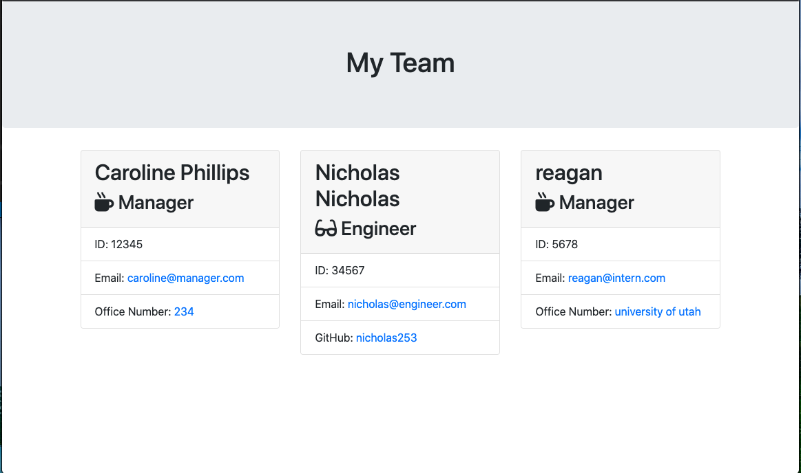

# team-profile-generator

This application is great for building a list of your team members quickly by using the command line!

To use this application, you need to open your terminal and run the script by typing "node app.js". Then you will be prompted to enter your team members information and an HTML file will instantly be created!

